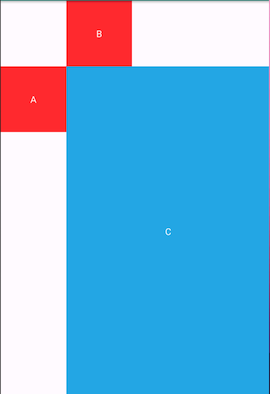

# ConstraintLayout

约束布局(ConstraintLayout)是Android Studio 2.2后新增的一种布局，目前已经成为新建项目的默认布局，相比传统布局(RelativeLayout, LinearLayout, FrameLayout)，它可以

+ 减少布局层级
+ 完成一些之前无法在xml中完成的功能

相对布局(RelativeLayout)是传统布局中最灵活的布局方式，因此本文主要介绍约束布局和相对布局在功能及性能上的差异，清楚差异之后，我们自然就可以知道约束布局的适用场景。

本文不包含约束布局全部的使用姿势，如果需要进一步了解各属性的使用方式，推荐阅读[官方文档](https://developer.android.google.cn/reference/android/support/constraint/ConstraintLayout)

约束布局功能和性能测试的[demo](../../../demo).

## 约束空间

约束空间是一个包含上下左右边界位置的范围。通常，我们需要首先为每一个view设置一个约束空间，然后再使用其他约束来确定view的宽高以及在约束空间中的相对位置。

例如下面的代码声明了一个水平方向从A的右边到父布局右边界，垂直方向从B的下方到父布局下边界的约束空间。

```xml
<TextView
    android:id="@+id/tv_c"
    android:layout_width="0dp"
    android:layout_height="0dp"
    app:layout_constraintLeft_toRightOf="@id/tv_a"
    app:layout_constraintTop_toBottomOf="@id/tv_b"
    app:layout_constraintRight_toRightOf="parent"
    app:layout_constraintBottom_toBottomOf="parent"
    .../>
```



## 功能优势

+ #### 百分比布局

  在约束布局中，我们可以设置view的宽高占整个约束空间宽高的百分比。

  例如下面代码设置了B宽度为约束空间宽度的30%。

  ```xml
  <TextView
      android:id="@+id/tv_percent"
      android:layout_width="0dp"
      android:layout_height="0dp"
      app:layout_constraintLeft_toRightOf="@id/tv_a"
      app:layout_constraintRight_toRightOf="parent"
      app:layout_constraintTop_toTopOf="@id/tv_a"
      app:layout_constraintBottom_toBottomOf="@id/tv_a"
      app:layout_constraintWidth_percent="0.3"
      .../>
  ```

  

  使用相对布局时，我们无法在xml中实现这个功能。

+ #### 偏压(bias)

  在约束布局中，view通常不会充满整个约束空间，我们可以以百分比的形式设置view在水平/垂直方向的位置。

  例如下面的代码设置了B左右空隙宽度比为1:4.

  ```xml
  <TextView
      android:id="@+id/tv_percent"
      android:layout_width="0dp"
      android:layout_height="0dp"
      app:layout_constraintLeft_toRightOf="@id/tv_a"
      app:layout_constraintRight_toRightOf="parent"
      app:layout_constraintTop_toTopOf="@id/tv_a"
      app:layout_constraintBottom_toBottomOf="@id/tv_a"
      app:layout_constraintWidth_percent="0.3"
      app:layout_constraintHorizontal_bias="0.2"
      .../>
  ```

  

  使用相对布局时，我们无法在xml中实现这个功能。

+ #### 宽高比

  在约束布局中，可以设置view的宽高比。

  例如下面代码设置了A宽高比为1:1

  ```xml
  <TextView
      android:id="@+id/tv_a"
      android:layout_width="0dp"
      android:layout_height="50dp"
      app:layout_constraintLeft_toLeftOf="parent"
      app:layout_constraintTop_toTopOf="parent"
      app:layout_constraintDimensionRatio="1:1"
      .../>
  ```

  

  使用相对布局时，我们无法在xml中实现这个功能。

+ #### goneMargin

  在约束布局中，可以设置view在依赖的view消失时，距离新依赖的margin值。

  例如下面的代码设置了A消失之后，view的左边距由50dp变为10dp。

  ```xml
  <TextView
      android:id="@+id/tv_gone_margin_b"
      android:layout_width="0dp"
      android:layout_height="50dp"
      app:layout_constraintLeft_toRightOf="@id/tv_gone_margin_a"
      app:layout_constraintRight_toRightOf="parent"
      app:layout_constraintTop_toTopOf="@id/tv_gone_margin_a"
      app:layout_constraintBottom_toBottomOf="@id/tv_gone_margin_a"
      android:layout_marginLeft="50dp"
      app:layout_goneMarginLeft="10dp"
      .../>
  ```

  

  

  使用相对布局时，我们无法在xml中实现这个功能。

+ #### Chain

  在约束布局中，可以将一系列view在水平/垂直方向串成一条链(Chain)。通过设置链的style控制整条链的显示策略。我们最常用的就是为链中不同view设置不同权重。

  例如下面的代码设置了两个蓝色背景的view宽度比为2:1.

  ```xml
  <TextView
      android:id="@+id/tv_chain_a"
      android:layout_width="50dp"
      android:layout_height="50dp"
      app:layout_constraintLeft_toLeftOf="parent"
      android:layout_marginLeft="10dp"
      app:layout_constraintRight_toLeftOf="@id/tv_chain_vote_a"
      .../>
  
  <TextView
      android:id="@+id/tv_chain_vote_a"
      android:layout_width="0dp"
      android:layout_height="50dp"
      app:layout_constraintLeft_toRightOf="@id/tv_chain_a"
      app:layout_constraintRight_toLeftOf="@id/tv_chain_vs"
      app:layout_constraintTop_toTopOf="@id/tv_chain_a"
      app:layout_constraintHorizontal_weight="2"
      .../>
  
  <TextView
      android:id="@+id/tv_chain_vs"
      android:layout_width="50dp"
      android:layout_height="50dp"
      app:layout_constraintLeft_toRightOf="@id/tv_chain_vote_a"
      app:layout_constraintRight_toLeftOf="@id/tv_chain_vote_b"
      app:layout_constraintTop_toTopOf="@id/tv_chain_vote_a"
      .../>
  
  <TextView
      android:id="@+id/tv_chain_vote_b"
      android:layout_width="0dp"
      android:layout_height="50dp"
      app:layout_constraintLeft_toRightOf="@id/tv_chain_vs"
      app:layout_constraintRight_toLeftOf="@id/tv_chain_b"
      app:layout_constraintTop_toTopOf="@id/tv_chain_vs"
      app:layout_constraintHorizontal_weight="1"
      .../>
  
  <TextView
      android:id="@+id/tv_chain_b"
      android:layout_width="50dp"
      android:layout_height="50dp"
      app:layout_constraintLeft_toRightOf="@id/tv_chain_vote_b"
      app:layout_constraintRight_toRightOf="parent"
      android:layout_marginRight="10dp"
      app:layout_constraintTop_toTopOf="@id/tv_chain_vote_b"
      .../>
  ```

  

  使用相对布局时，我们需要嵌套线性布局实现这个功能。

+ #### Barrier

  在约束布局中，Barrier是一条不可见的水平/垂直辅助线，Barrier的位置可以是一个/一组已有view的边界位置。后面其他view可以借助Barrier设置自己的约束空间。

  例如下面的代码实现了A、B宽度变化时，C始终在AB整体的右边

  ```xml
  <TextView
      android:id="@+id/tv_barrier_a"
      android:layout_width="100dp"
      android:layout_height="50dp"
      .../>
  
  <TextView
      android:id="@+id/tv_barrier_b"
      android:layout_width="150dp"
      android:layout_height="60dp"
      app:layout_constraintLeft_toLeftOf="@id/tv_barrier_a"
      app:layout_constraintTop_toBottomOf="@id/tv_barrier_a"
      android:layout_marginTop="10dp"
      .../>
  
  <androidx.constraintlayout.widget.Barrier
      android:id="@+id/barrier_vertical"
      android:layout_width="wrap_content"
      android:layout_height="wrap_content"
      app:barrierDirection="right"
      app:constraint_referenced_ids="tv_barrier_a, tv_barrier_b"/>
  
  <TextView
      android:id="@+id/tv_barrier_c"
      android:layout_width="100dp"
      android:layout_height="50dp"
      app:layout_constraintLeft_toRightOf="@id/barrier_vertical"
      app:layout_constraintRight_toRightOf="parent"
      app:layout_constraintTop_toTopOf="@id/tv_barrier_a"
      app:layout_constraintBottom_toBottomOf="@id/tv_barrier_b"
      .../>
  ```

  

  

  使用相对布局时，我们需要布局嵌套实现这个功能。

+ #### Guideline

  Guideline也是一条不可见的水平/垂直辅助线，与Barrier的不同之处在于它的位置是整个布局中的一个固定位置。

+ #### Group

  在约束布局中，可以将多个view设置成一个group。后续可以一次性设置整个group的可见性，减少代码量。

+ #### Transition

  在约束布局中，当view的位置或大小发生变化时，我们可以很方便的为其设置动画效果，提升用户体验。

  

## 功能缺点

+ #### margin不能为负值

  在约束布局中，margin设置成负值无效。

  例如约束布局无法完美实现这样的布局。

  

+ #### 简单约束没有传统布局方便

  对于简单的约束，例如只是要在父布局中居中，以前一行代码搞定的事情使用约束布局要4行。


## 性能

[官方测试](https://github.com/googlesamples/android-constraint-layout-performance)结果是约束布局的性能要优于传统布局。

我选取了一些能凸显约束布局减少布局层级的场景，使用约束布局和传统布局分别实现了同一个界面进行测试，

分AT_MOST和EXACTLY两种情况分别measure+layout 1000次求平均值，结果是**传统布局性能明显优于约束布局**。

测试环境：模拟器Nexus 5X, Android 7.0；ConstraintLayout-v1.1.3

|                   | AT_MOST | EXACTLY |
| ----------------- | ------- | ------- |
| ConstraintLayout  | 1.324ms | 0.551ms |
| TraditionalLayout | 0.374ms | 0.387ms |

下面是其他工程师发布的的性能测试结果，都是约束布局性能较差。约束布局还在不停的更新中，相信未来Google的工程师会对约束布局的性能做进一步的优化。

[Constraint Layout performance](https://android.jlelse.eu/constraint-layout-performance-870e5f238100)

[Constraint Layout performance](https://medium.com/@krpiotrek/constraintlayout-performance-c1455c7984d7)

## 其他

+ 布局编辑器

  我们可以在Android Studio中使用图形界面生成约束布局。 [官方教程](https://developer.android.google.cn/training/constraint-layout)

+ 传统布局转换成约束布局

  Android Studio中提供将传统布局转换成约束布局的功能，亲测不好用，请谨慎使用。
