# iOS开发 - 动画简介

## 概述

动画是移动端开发比较重要的一部分。也许有些人因为公司业务的特点，日常工作中没什么机会涉及到动画，但是作为一个iOS开发者，掌握动画的基础知识仍然是必要的（至少能在面试中有所帮助吧😋）。
希望能在这篇文章中让大家对iOS动画有所了解，获得动画实现的一些思路，可以自己实现更加华丽的动画效果。
计划包括如下内容和一些Demo:

- [X] CALayer
    - [X] 容易混淆的属性
        - [X] bounds和frame
        - [X] anchorPoint
        - [X] content
        - [X] transform
    - [X] 绘图
- [ ] Core Animation
    - [X] CABasicAnimation
    - [X] CAKeyframeAnimation
    - [ ] CAAnimationGroup
    - [ ] CADisplayLink
    - [ ] 交互动画
    - [X] CGAffineTransform和矩阵变换
- [ ] 番外篇

## CALayer

在开始之前，推荐大家读一篇文章：[绘制像素到屏幕上](https://objccn.io/issue-3-1/)。这是一篇写原理的文章。这类文章我个人的看法是可能开始的时候你不是必须了解它，但是如果你需要进阶，了解原理是很必要的。

### CALayer和UIView的关系

每个UIView都默认包含一个layer. CALayer可以理解成一个画布，我们在UIView上看到的东西，实际都是由CALayer来呈现的。UIView是UIResponder的子类，它的职责是负责和用户交互。
CALayer和UIView的关系是这样的：

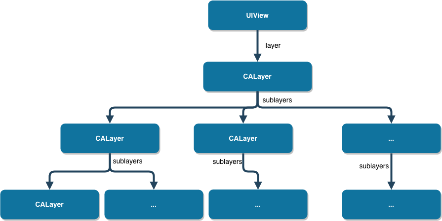

### 属性篇

这节里，我想要讨论一些CALayer里比较有意思的属性。关于*有意思*，指的是那些很容易混淆或者被忽略的属性。主要是我想不出什么词可以准确而且不啰嗦的表达我的意思。
CALayer比较常用的属性如下（有落下的请指出）：

- 位置属性
    - bounds，大小，它和`frame`的区别就是`bounds`的`origin`总是(0, 0),还有一点我不太确定，就是bounds和frame的size有没有可能不一样（UIView会有，在做旋转变换的时候），我会写个demo测试一下。
    - frame，大小+位置,和bounds的区别里少些了一条，**frame不支持隐式动画**。
    - position，中心点，相当于`UIView`的`center`
    - anchorPoint(anchorPointZ)，锚点
- 形状
    - backgroundColor，背景色
    - borderColor，边框色
    - borderWidth，边框宽度
    - shadowColor，阴影颜色
    - shadowOffset，阴影距离
    - shadowOpacity，阴影透明度
    - shadowPath，阴影形状
    - shadowRadius，阴影模糊半径
    - cornerRadius, 圆角半径
    - mask，蒙版
    - maskToBounds, 子图层是否剪切图层边界，默认为NO
    - opacity, 透明度，对应`UIView`的`alpha`
- hidden
- sublayers
- contents，寄宿图, 这个属性比较有迷惑性
- contentsRect，显示内容的位置和大小
- transform, 矩阵变换

#### bounds和frame

面试的时候通常这两个属性的区别，大家都能答出来。但是我曾经问过一个问题：它们两个的size在什么情况下不一样，很多人就会卡壳。
我写了一个demo，来观察在`CALayer`旋转的时候，`bounds`和`frame`的`size`是否也会像`UIView`的`bounds`和`frame`似的，`size`不同。
代码片段：

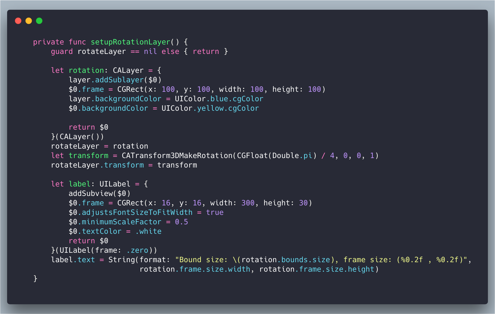
执行结果如下：

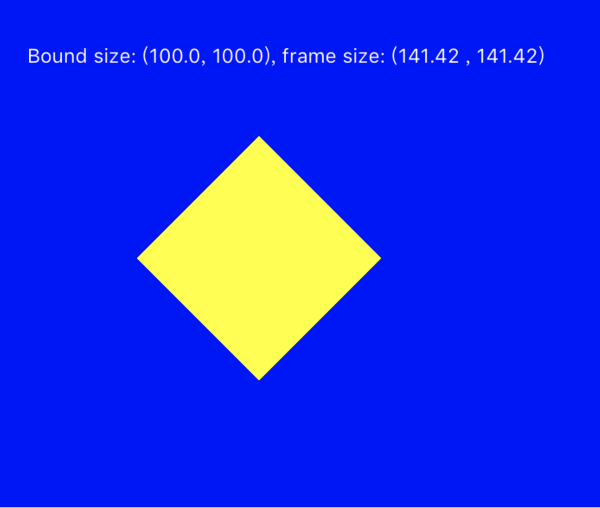

`bounds`和`frame`在demo中是这样的：

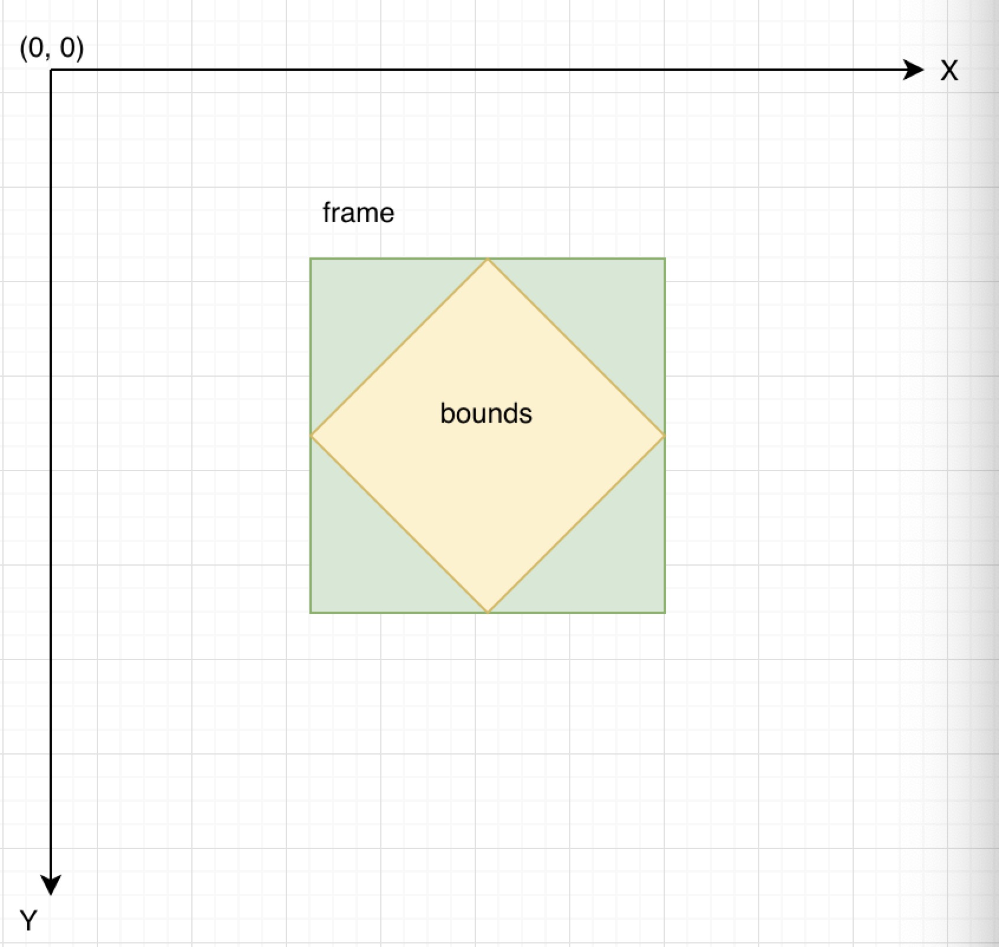

另外，上文提到了，frame不支持隐式动画。
CALayer中大部分属性都支持隐式动画。所以隐式动画，就是当你修改了某个属性的时候，自动会有动画效果，不需要你做什么。

#### anchorPoint

提到锚点, 很多人知道在做旋转动画的时候，layer会围绕着锚点旋转。但是锚点具体是什么，不少人说不清楚。
锚点的取值范围是(0, 0) - (1, 1)，默认值是(0.5, .05)。
推荐一篇文章，把锚点讲的很清楚：[彻底理解position与anchorPoint](http://wonderffee.github.io/blog/2013/10/13/understand-anchorpoint-and-position/)
以下摘抄自该文章，用来记录一些要点：

> 1、position是layer中的anchorPoint在superLayer中的位置坐标。
> 2、互不影响原则：单独修改position与anchorPoint中任何一个属性都不影响另一个属性。
> 3、frame、position与anchorPoint有以下关系
>
> - frame.origin.x = position.x - anchorPoint.x * bounds.size.width；  
> - frame.origin.y = position.y - anchorPoint.y * bounds.size.height；

引文里的这个公式，能很好的解释为什么修改锚点，layer的位置会移动。

#### contents

寄宿图。
它的定义是`open var contents: Any?`,看起来很*随和*。但是它其实只接受`CGImage`。
当使用`let view = UIView(frame: CGRectMake(0, 0, 200, 200))`生成一个视图对象并添加到屏幕上时，从`CALayer`的结构可以知道，这个视图的`layer`的三个视觉元素是这样的：`contents`为空，`backgroundColor`空(透明色)，`borderWidth`0，这个视图从视觉上看什么都看不到。`CALayer`文档第一句话就是：

> The CALayer class manages image-based content and allows you to perform animations on that content.」

UIView 的显示内容很大程度上就是一张图片(CGImage)。

*所以出现了一个名为*`UIImageView`*的东西，因为给layer赛一个image进去太方便了。*

#### transform

请参考章节：CGAffineTransform和矩阵变换。希望我能够说明白，线性代数都还给老师了。

### 绘制篇

CALayer的绘制比较常见的方式：

- `CAShapeLayer`绘制
- 实现`CALayerDelegate`绘制
- 子类化`CALayer`并重写`open func draw(in ctx: CGContext)`

#### CAShapeLayer

`CAShapeLayer`很适合用在画线条图形的场合。
`CAShapeLayer`的特殊性在于它是通过矢量图而非位图进行绘制的。不用位图意味着它的内存消耗会占不小的优势。
`CAShapeLayer`是少数几个不依附于`UIView`就能显示的`CALayer`。它的渲染速度比`Core Graphics`要快。
先来看个例子：

```Swift
let width: CGFloat = 300
let height: CGFloat = 300

let shapeLayer = CAShapeLayer()
shapeLayer.frame = CGRect(x: 0, y: 100,
                          width: width, height: height)

let path = CGMutablePath()

stride(from: 0, to: CGFloat.pi * 2, by: CGFloat.pi / 6).forEach {
    angle in
    var transform  = CGAffineTransform(rotationAngle: angle)
        .concatenating(CGAffineTransform(translationX: width / 2, y: height / 2))
    
    let petal = CGPath(ellipseIn: CGRect(x: -20, y: 0, width: 40, height: 100),
                       transform: &transform)
    
    path.addPath(petal)
}

shapeLayer.path = path
shapeLayer.strokeColor = UIColor.red.cgColor
shapeLayer.fillColor = UIColor.yellow.cgColor
shapeLayer.fillRule = .evenOdd

view.layer.addSublayer(shapeLayer)
```

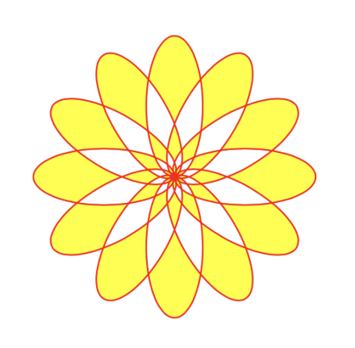

下面是`CAShapeLayer`常用的属性：

- `var path: CGPath?` - `CAShapeLayer`依靠路径来绘图
- `var fillColor: CGColor?` - 填充颜色
- `var fillRule: CAShapeLayerFillRule` - 填充规则
- `var strokeColor: CGColor?` - 绘制颜色
- `var strokeStart: CGFloat` - 和下面那个属性一起，绘制的起始和结束位置，取值范围是0~1
- `var strokeEnd: CGFloat`
- `var lineWidth: CGFloat` - 线宽
- `var miterLimit: CGFloat` - 最大的斜接长度，就是两个线条交汇的时候，交汇处和外交之间的距离。如果斜接超过限制，边角会按照`lineJoin`的`.bevel`显示。它只会有当`lineJoin`为`.miter`(默认值)时候才有起作用。
- `var lineCap: CAShapeLayerLineCap` - 线顶端类型
- `var lineJoin: CAShapeLayerLineJoin` - 连线的风格，就是线之间怎么结合
- `var lineDashPhase: CGFloat` - `lineDashPattern`的起点，默认是0
- `var lineDashPattern: [NSNumber]?` - 画虚线用的，它定义了虚线和实线的长度

*TODO - 有时间做一个CAShapeLayer的动画*

`CALayer`还有很多子类，分别适合于不同用途的绘制，例如`CATextLayer`。希望大家能大致的了解一下。


#### 实现`CALayerDelegate`绘制

用这种方式为layer绘制，**记得**要调用它的`open func setNeedsDisplay()`方法。不然代理方法不会触发。

代码如下：

```Swift
class DrawLayerViewController: UIViewController {
    private var delegateLayer: CALayer?
    ……
    @IBAction func tapDelegate(_ sender: UIButton) {
        reset()
        delegateLayer = CALayer()
        delegateLayer?.frame = CGRect(x: (UIScreen.main.bounds.width - 300.0) / 2.0, y: 100,
                                  width: 300, height: 300)
        delegateLayer?.delegate = self
        if let layer = delegateLayer {
            view.layer.addSublayer(layer)
            layer.setNeedsDisplay()
        }
    }
    ……
}

extension DrawLayerViewController: CALayerDelegate {
    func draw(_ layer: CALayer, in ctx: CGContext) {
        if let image: UIImage = UIImage(named: "transform.demo"), let cgImage = image.cgImage {
            ctx.saveGState()
            
            // Core Graphics的坐标系是自然坐标系，因此需要变换一下和UIView的坐标系一致
            let scale = layer.bounds.size.width / image.size.width // 因为Demo用的图片宽比高要大
            ctx.scaleBy(x: scale, y: -scale)
            ctx.translateBy(x: 0, y: -image.size.height)
            ctx.draw(cgImage, in: CGRect(origin: .zero, size: image.size))
            
            ctx.restoreGState()
        }
    }
}

```

继续请出我们之前找到的免费图片。

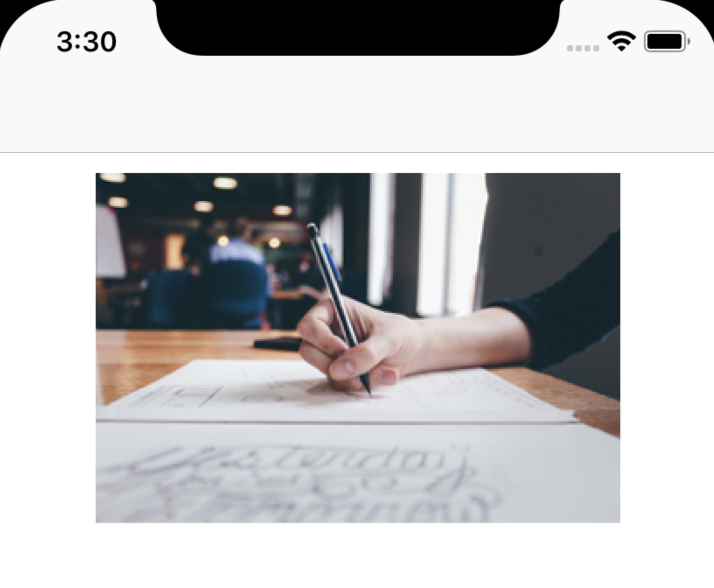

#### 子类化`CALayer`并重写`open func draw(in ctx: CGContext)`

```Swift
class CustomLayer: CALayer {
    override func draw(in ctx: CGContext) {
        if let image: UIImage = UIImage(named: "transform.demo"), let cgImage = image.cgImage {
            ctx.saveGState()
            
            // Core Graphics的坐标系是自然坐标系，因此需要变换一下和UIView的坐标系一致
            let scale = bounds.size.width / image.size.width // 因为Demo用的图片宽比高要大
            ctx.scaleBy(x: scale, y: -scale)
            ctx.translateBy(x: 0, y: -image.size.height)
            ctx.draw(cgImage, in: CGRect(origin: .zero, size: image.size))
            
            ctx.restoreGState()
        }
    }
}

class DrawLayerViewController: UIViewController {
    private var drawInContextLayer: CALayer?
    ……

    @IBAction func tapDrawInContext(_ sender: UIButton) {
        reset()
        drawInContextLayer = CustomLayer()
        drawInContextLayer?.frame = CGRect(x: (UIScreen.main.bounds.width - 300.0) / 2.0, y: 100,
                                      width: 300, height: 300)
        if let layer = drawInContextLayer {
            view.layer.addSublayer(layer)
            layer.setNeedsDisplay()
        }
    }
}
```


## Core Animation

Core Animation主要的接口和类关系如下图：

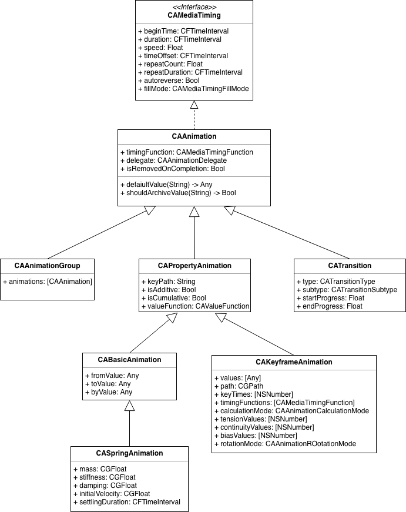

推荐看一遍Apple官方文档[Core Animation Programming Guide](https://developer.apple.com/library/archive/documentation/Cocoa/Conceptual/CoreAnimation_guide/Introduction/Introduction.html#//apple_ref/doc/uid/TP40004514)

### CABasicAnimation

`CAPropertiAnimation`提供了基于`keyPath`的动画，它作为一个基类，是不能直接使用的。

#### keyPath

`keyPath`指的就是layer的那些支持动画的属性。所有带隐式动画的属性都包含在内。

| keyPath              | Description                                                                |
| :------------------- | :------------------------------------------------------------------------- |
| anchorPoint          | 修改锚点，就是修改`frame`                                                  |
| backgroundColor      | 背景色                                                                     |
| borderColor          | 边框颜色                                                                   |
| borderWidth          | 边框宽度                                                                   |
| bounds               | 大小，不会影响中心点，这个不受`anchorPoint`影响, 另外，**frame不支持动画** |
| cornerRadius         | 圆角                                                                       |
| contents             | 寄宿图, 不过用这个做动画感觉有点怪, `UIImageView`本身就支持动画            |
| contentsRect         | 同上，有点怪，但是它就是带隐式动画                                         |
| mask                 | 蒙版                                                                       |
| maskToBounds         | 是否裁剪边界                                                               |
| opacity              | 透明度                                                                     |
| position             | 中心点                                                                     |
| shadowColor          | 阴影那几个属性都可以，后面不列举了，太啰嗦了                               |
| transform.scale      | 缩放                                                                       |
| transform.scale.x    | 水平方向的缩放                                                             |
| transform.scale.y    | 竖直方向的缩放                                                             |
| transform.rotation.x | 沿x轴旋转                                                                  |
| transform.rotation.y | 沿y轴旋转                                                                  |
| transform.rotation.z | 沿z轴旋转                                                                  |


#### 关闭隐式动画

下面这段代码，展示了一个红色的圆背景色变成蓝色的动画。

```Swift
class AnimatioinViewController: UIViewController {
    
    private var animationLayer: CALayer?

    @IBAction func tapAnimation(_ sender: UIButton) {
        animationLayer?.removeFromSuperlayer()
        animationLayer?.removeAllAnimations()
        let layer = CALayer()
        layer.frame = CGRect(x: UIScreen.main.bounds.size.width / 2.0 - 100.0,
                             y: UIScreen.main.bounds.size.height / 2.0 - 100.0,
                             width: 200.0,
                             height: 200.0)
        view.layer.addSublayer(layer)
        layer.cornerRadius = 100.0
        layer.masksToBounds = true
        layer.backgroundColor = UIColor.red.cgColor
        animationLayer = layer
        DispatchQueue.main.asyncAfter(deadline: .now() + 0.5) {
            let animation = CABasicAnimation(keyPath: "backgroundColor")
            animation.toValue = UIColor.blue.cgColor
            animation.duration = 1
            animation.delegate = self
            layer.add(animation, forKey: nil)
        }
    }
}

extension AnimatioinViewController: CAAnimationDelegate {
    func animationDidStop(_ anim: CAAnimation, finished flag: Bool) {
        if let layer = animationLayer, let animation = anim as? CABasicAnimation {
            layer.backgroundColor = animation.toValue as! CGColor
        }
    }
}
````

不贴运行效果了，太丑。

最后一段代码，在动画结束的时候，把颜色保持在动画的`toValue`指定的颜色。
执行一下，可以看到一个很怪异的效果：动画结束时候，颜色重新会到红色，然后展示了一个很短的动画效果，变成了蓝色。这个是因为我们之前提到的`backgroundColor`支持隐式动画。
解决这个，需要用代码禁止隐式动画。

```Swift
extension AnimatioinViewController: CAAnimationDelegate {
    func animationDidStop(_ anim: CAAnimation, finished flag: Bool) {
        if let layer = animationLayer, let animation = anim as? CABasicAnimation {
            CATransaction.begin()
            CATransaction.setDisableActions(true)
            layer.backgroundColor = animation.toValue as! CGColor
            CATransaction.commit()
        }
    }
}
```

**遇到一个问题：**
看下这句话
```Swift
layer.backgroundColor = animation.toValue as! CGColor
```

通常我不喜欢用强制解包，我的习惯会是这样写：

```Swift
if let layer = animationLayer, 
   let animation = anim as? CABasicAnimation, 
   let finalColor = animation.toValue as? CGColor {
    CATransaction.begin()
    CATransaction.setDisableActions(true)
    layer.backgroundColor = finalColor
    CATransaction.commit()
}
```

但是Xcode编译报错，说是`let finalColor = animation.toValue as? CGColor`这个转换永远会成功，不应该用`as?`，但是我去掉`as?`，编译会报错，说不能从`Any?`直接转成`CGColor`, 改成现在的样子，Xcode又会薄警告。好烦。


### CAKeyframeAnimation

同样作为`CAPropertyAnimation`的子类，`CAKeyframeAnimation`接受一组值来呈现动画，这是它比`CABasicAnimation`强大的地方。
还用上面那个动画作为例子：

```Swift
class AnimatioinViewController: UIViewController {
    
    private weak var animationLayer: CALayer!
    private var randomColor: CGColor {
        let red = CGFloat(arc4random()) / CGFloat(UInt32.max)
        let green = CGFloat(arc4random()) / CGFloat(UInt32.max)
        let blue = CGFloat(arc4random()) / CGFloat(UInt32.max)
        return UIColor(red: red, green: green, blue: blue, alpha: 1.0).cgColor
    }

    override func viewDidLoad() {
        super.viewDidLoad()

        // Do any additional setup after loading the view.
        setupAnimationLayer()
    }

    ......    

    @IBAction func tapKeyframe(_ sender: UIButton) {
        animationLayer.removeAllAnimations()
        let animation = CAKeyframeAnimation(keyPath: "backgroundColor")
        animation.values = [randomColor, randomColor, randomColor, randomColor, randomColor]
        animation.duration = 7
        animation.delegate = self
        self.animationLayer.add(animation, forKey: nil)
    }
    
    private func setupAnimationLayer() {
        let layer = CALayer()
        layer.frame = CGRect(x: UIScreen.main.bounds.size.width / 2.0 - 100.0,
                             y: UIScreen.main.bounds.size.height / 2.0 - 100.0,
                             width: 200.0,
                             height: 200.0)
        view.layer.addSublayer(layer)
        layer.cornerRadius = 100.0
        layer.masksToBounds = true
        layer.backgroundColor = UIColor.red.cgColor
        animationLayer = layer
    }
}

extension AnimatioinViewController: CAAnimationDelegate {
    func animationDidStop(_ anim: CAAnimation, finished flag: Bool) {
        if let layer = animationLayer, let animation = anim as? CABasicAnimation {
            CATransaction.begin()
            CATransaction.setDisableActions(true)
            layer.backgroundColor = animation.toValue as! CGColor
            CATransaction.commit()
        } else if let layer = animationLayer, let animation = anim as? CAKeyframeAnimation {
            CATransaction.begin()
            CATransaction.setDisableActions(true)
            layer.backgroundColor = animation.values?.last as! CGColor
            CATransaction.commit()
        }

    }
}
```

`CAKeyframeAnimation`让人喜欢之处在于，它对关键帧的多重控制方式。除了例子中使用的`values`之外，它还可以通过`path`来控制动画，以及`keyTimes`, `timingFunctions`, `calculationMode`来控制动画的曲线。

再来看个例子：

```Swift
    private func setupPaperPlane() {
        let path = CGMutablePath()
        path.move(to: CGPoint(x: 100, y: 50))
        path.addLine(to: CGPoint(x: 23, y: 18))
        path.addLine(to: CGPoint(x: 25, y: 40))
        path.addLine(to: CGPoint(x: 100, y: 50))
        path.addLine(to: CGPoint(x: 18, y: 55))
        path.addLine(to: CGPoint(x: 3, y: 100))
        path.addLine(to: CGPoint(x: 100, y: 50))
        path.addLine(to: CGPoint(x: 45, y: 95))
        path.addLine(to: CGPoint(x: 40, y: 82))
        path.move(to: CGPoint(x: 25, y: 40))
        path.addLine(to: CGPoint(x: 35, y: 55))
        let layer = CAShapeLayer()
        layer.path = path
        layer.strokeColor = UIColor.gray.cgColor
        layer.fillColor = UIColor.white.cgColor
        layer.lineWidth = 2.1
        layer.lineJoin = .round
        view.layer.addSublayer(layer)
        layer.position = CGPoint(x: 20, y: 200)
        paperPlane = layer
    }
```

先画个纸飞机，不是太好看，大家包涵。

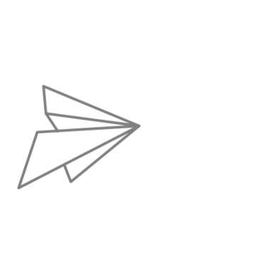

然后用贝塞尔曲线模拟一个飞行的线路：

```Swift
    @IBAction func tapPaperPlane(_ sender: UIButton) {
        paperPlane.removeAllAnimations()
        paperPlane.isHidden = false
        animationLayer.isHidden = true
        
        let animation = CAKeyframeAnimation(keyPath: "position")
        let bezierPath = UIBezierPath()
        bezierPath.move(to: paperPlane.position)
        bezierPath.addCurve(to: CGPoint(x: 150, y: 600), controlPoint1: CGPoint(x: 300, y: 300), controlPoint2: CGPoint(x: 80, y: 440))
        animation.path = bezierPath.cgPath
        animation.duration = 7
        animation.rotationMode = .rotateAuto
        self.paperPlane.add(animation, forKey: nil)
    }
```

注意这行代码：

```Swift
animation.rotationMode = .rotateAuto
```

它的作用是让动画自动按照路径的切线调整方向。
可以注释这句话对比看下效果。

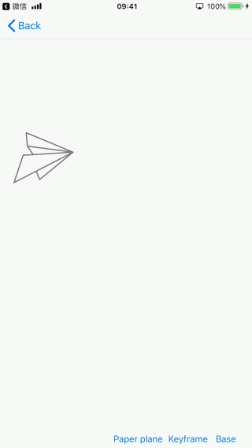

### CAAnimationGroup


### CADisplayLink

### 交互动画

### CGAffineTransform和矩阵变换
在写这一篇之前，我企图重新学一下线性代数中矩阵相关的知识，但是可耻的失败了。也许我还会去继续挑战它，但是这篇文章不想再拖下去了，我就无耻的忽略理论直接讲了。如果这篇文章有幸被哪位高手看到，且高手实在是不能忍受我的错误百出而加以指点，那就很开心了。
总之，我会尽量准确。另外，有志于重拾大学线代的同学，可以看下`3Blue1Brown`的视频课程。他在B站有账户。[【双语字幕】「线性代数的本质」合集](https://www.bilibili.com/video/av6731067/)

#### 仿射变换
`UIView`的`transform`类型为`CGAffineTransform`, 它是个用作二维变换的3*2的矩阵。
看下它的定义：
```Swift
public struct CGAffineTransform {

    public var a: CGFloat

    public var b: CGFloat

    public var c: CGFloat

    public var d: CGFloat

    public var tx: CGFloat

    public var ty: CGFloat

    public init()

    public init(a: CGFloat, b: CGFloat, c: CGFloat, d: CGFloat, tx: CGFloat, ty: CGFloat)
}
```

因为第三列是固定的`[0, 0, 1]`, 所以只需要定义一个3*2矩阵。
这样（企图用markdown写矩阵公式失败）：
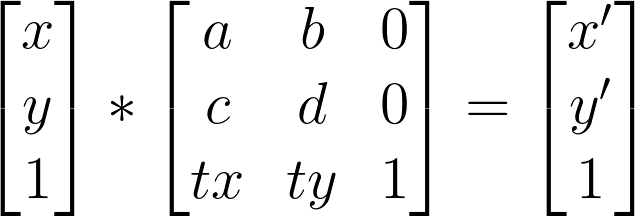

x' = ax + cy + tx
y' = xb + yd + ty 

*忽然进入容易理解的领域了*😋
##### 平移
x' = x + tx
y' = y + ty
所以a = 1, b = 0, c = 0, d = 1
平移的矩阵是:

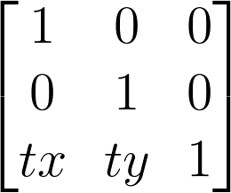

来看下平移变换的API的定义：
```Objective-C
/* Return a transform which translates by `(tx, ty)': t' = [ 1 0 0 1 tx ty ] */
CG_EXTERN CGAffineTransform CGAffineTransformMakeTranslation(CGFloat tx, CGFloat ty) CG_AVAILABLE_STARTING(10.0, 2.0);
```

它在`Swift`里是这样的

```Swift
    /* Return a transform which translates by `(tx, ty)':
         t' = [ 1 0 0 1 tx ty ] */
    
    @available(iOS 2.0, *)
    public /*not inherited*/ init(translationX tx: CGFloat, y ty: CGFloat)
```

##### 旋转
旋转的矩阵是:

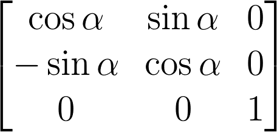

来看下旋转变换的API的定义：
```Swift
    /* Return a transform which rotates by `angle' radians:
         t' = [ cos(angle) sin(angle) -sin(angle) cos(angle) 0 0 ] */
    
    @available(iOS 2.0, *)
    public /*not inherited*/ init(rotationAngle angle: CGFloat)
```

##### 缩放
缩放的矩阵是:

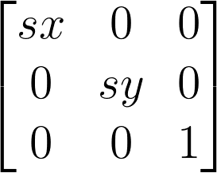

来看下缩放变换的API的定义：
```Swift
    /* Return a transform which scales by `(sx, sy)':
         t' = [ sx 0 0 sy 0 0 ] */
    
    @available(iOS 2.0, *)
    public /*not inherited*/ init(scaleX sx: CGFloat, y sy: CGFloat)
```

##### Demo
来看下Demo。先从免费图片网站[Startup Stock Photos](https://startupstockphotos.com/)找张图。


代码中演示四种变换：
- 平移
- 旋转
- 缩放
- 自由变换

代码如下：
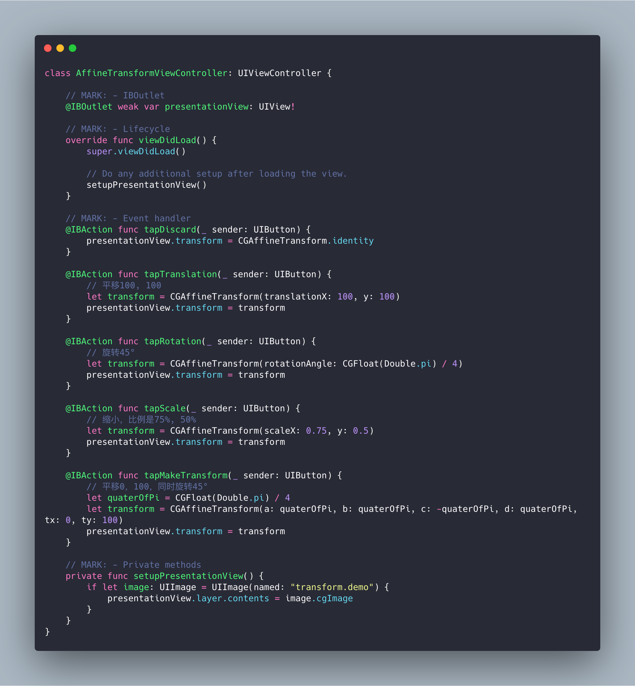
效果：
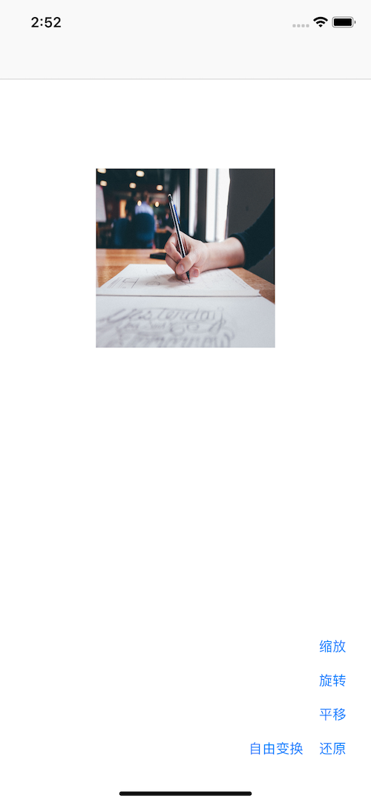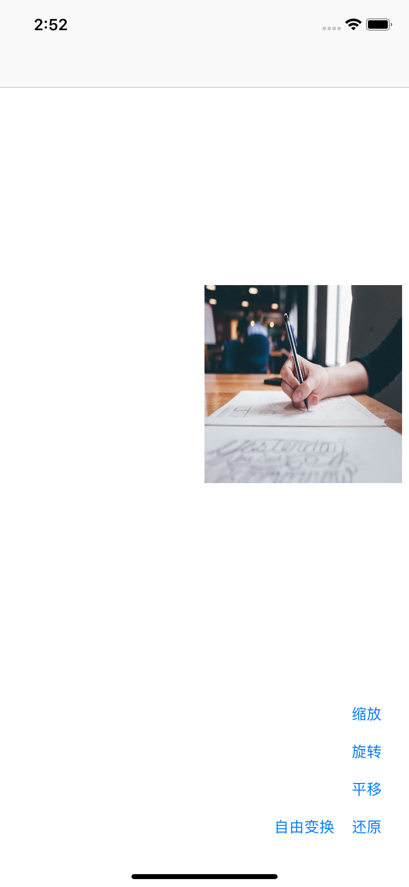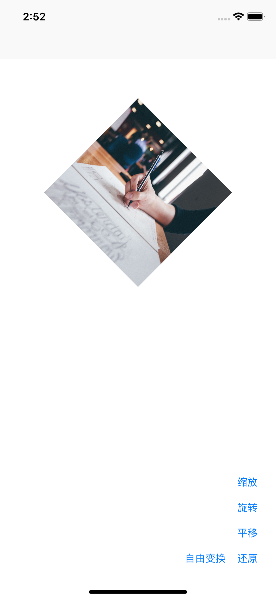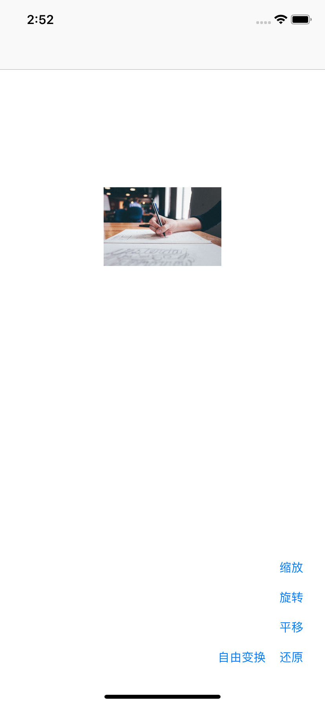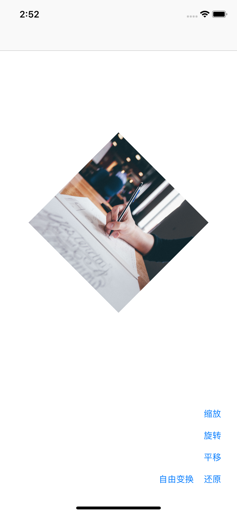


*平移 0，100，同时旋转45°*那部分代码，实际上可以这样写：
```Swift
let transform = CGAffineTransform(rotationAngle: CGFloat(Double.pi) / 4).translatedBy(x: 0, y: 100)
```

这里的`transform`实际上是这样的：

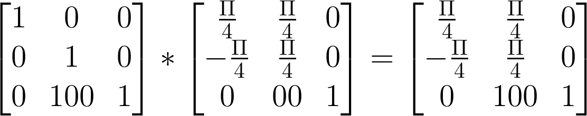

为了证明我确实是大学毕业，所以我勇敢的直接构造出了变换的结果。

```Swift
let quaterOfPi = CGFloat(Double.pi) / 4
let transform = CGAffineTransform(a: quaterOfPi, b: quaterOfPi, c: -quaterOfPi, d: quaterOfPi, tx: 0, ty: 100)
.translatedBy(x: 0, y: 100)
```


#### CATransform3D
我们讨论过二维变换矩阵之后，本节讨论三维变换。
##### CATransform3D的定义

```Swift
struct CATransform3D
{
  CGFloat m11, m12, m13, m14;
  CGFloat m21, m22, m23, m24;
  CGFloat m31, m32, m33, m34;
  CGFloat m41, m42, m43, m44;
};
```

`Swift`的写法太啰嗦了，我这里贴的是`Objective-C`的定义
这里可以看出来3D变换是一个4*4的矩阵。
它的`identity`是
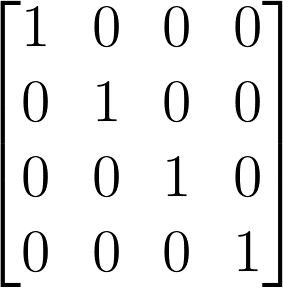


##### 平移
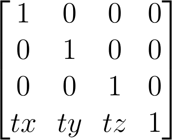

```Swift
/* Returns a transform that translates by '(tx, ty, tz)':
 * t' =  [1 0 0 0; 0 1 0 0; 0 0 1 0; tx ty tz 1]. */

@available(iOS 2.0, *)
public func CATransform3DMakeTranslation(_ tx: CGFloat, _ ty: CGFloat, _ tz: CGFloat) -> CATransform3D
```


##### 缩放
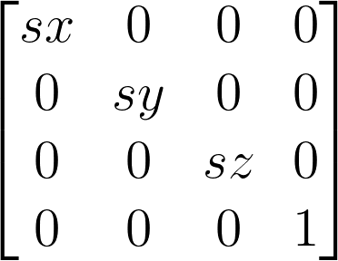


```Swift
/* Returns a transform that scales by `(sx, sy, sz)':
 * t' = [sx 0 0 0; 0 sy 0 0; 0 0 sz 0; 0 0 0 1]. */

@available(iOS 2.0, *)
public func CATransform3DMakeScale(_ sx: CGFloat, _ sy: CGFloat, _ sz: CGFloat) -> CATransform3D
```


##### 沿X轴旋转
$$
\begin{bmatrix}
1 &0 &0 &0 \\
0 &\cos \Theta  &\sin \Theta   &0 \\ 
0 &-\sin \Theta   &\cos \Theta   &0 \\ 
0 &0  &0  &1 
\end{bmatrix}
$$
**好吧github不支持矩阵的公式**😂

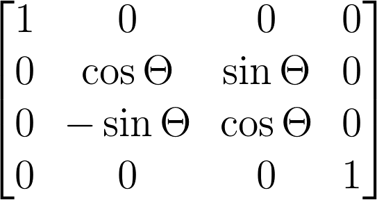

```Swift
public func CATransform3DMakeRotation(_ angle: CGFloat, _ x: CGFloat, _ y: CGFloat, _ z: CGFloat) -> CATransform3D
```


##### 沿Y轴旋转
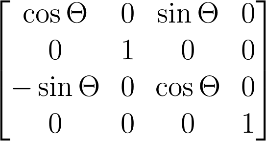

```Swift
public func CATransform3DMakeRotation(_ angle: CGFloat, _ x: CGFloat, _ y: CGFloat, _ z: CGFloat) -> CATransform3D
```


##### 沿Z轴旋转
沿Z轴旋转，其实就是2D的旋转。
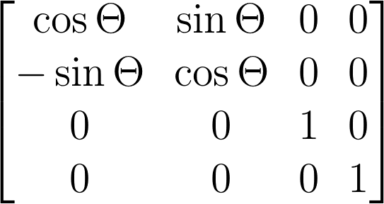

```Swift
public func CATransform3DMakeRotation(_ angle: CGFloat, _ x: CGFloat, _ y: CGFloat, _ z: CGFloat) -> CATransform3D
```


##### Demo

测试一下沿着X轴旋转的效果：

```Swift
    @IBAction func tap3DX(_ sender: UIButton) {
        let transform = CATransform3DMakeRotation(CGFloat(Float.pi) / 4, 1, 0, 0)
        presentationView.layer.transform = transform
    }
```

执行一下看什么效果：

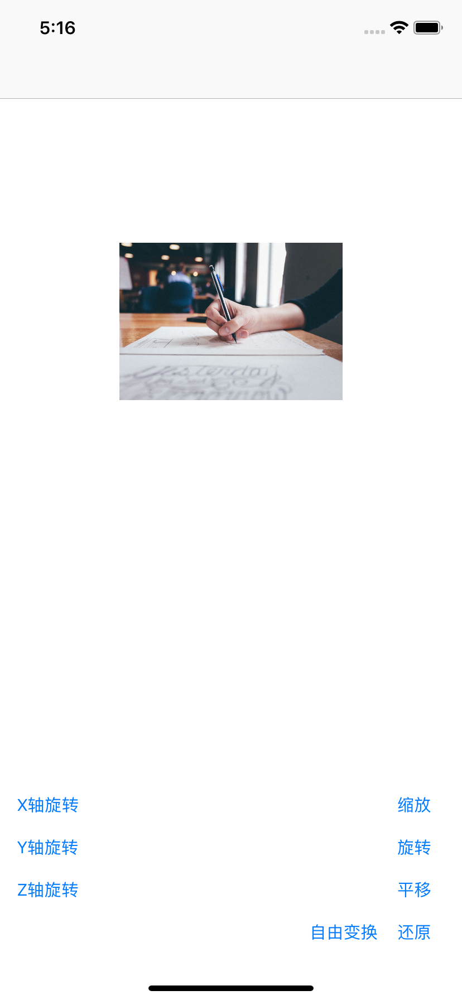

看起来完全没有3D旋转的效果，是不是。
我们来回顾一下`CATransform3D`的定义，还记得那些`mxx`的属性么。
```Swift
struct CATransform3D
{
CGFloat m11（x缩放）, m12（y切变）, m13（旋转）, m14（X轴透视）;
CGFloat m21（x切变）, m22（y缩放）, m23（）, m24（Y轴透视）;
CGFloat m31（旋转）, m32（）, m33（）, m34（Z轴透视）;
CGFloat m41（x平移）, m42（y平移）, m43（z平移）, m44（）;
}; 
```
有些m我也不清楚做什么的，惭愧，希望能有高手指点。

修改代码：
```Swift
    @IBAction func tap3DX(_ sender: UIButton) {
        var transform = CATransform3DIdentity
        transform.m34 = 1.0 / 800
        transform = CATransform3DRotate(transform, CGFloat(Float.pi) / 4, 1, 0, 0)
        presentationView.layer.transform = transform
    }
```

执行一下看什么效果：

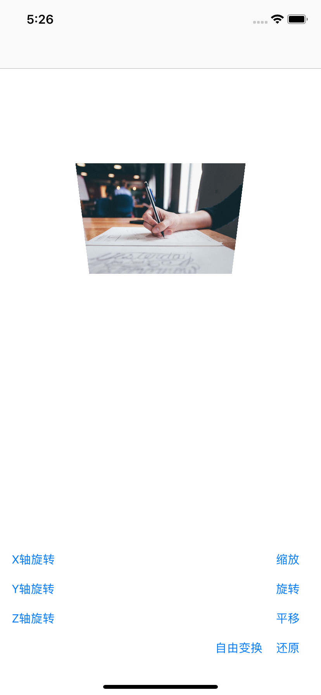


### 番外篇
写这样一章，是因为有一些不确定放在哪里合适的内容。有些内容可能不太成系统，但是值得写一下。
#### UIView的drawRect
`UIView`有个方法`open func draw(_ rect: CGRect)`
是很省事儿的自己绘制View的方法。但是我通常不建议通过它来进行绘制，而是建议用layer来实现。
因为该方法，会在内存中为rect申请一个buffer(实际就是寄宿图，寄宿图在CALayer时候讲过)，大小是`rect.size` * `contentsScale` * 4。所以当你企图做全屏绘制的时候，内存的消耗会相当大。
另外，如果你实现了`CALayerDelegate`，但是没有实现`displayLayer`，那么就会尝试调用`- (void)drawLayer:(CALayer *)layer inContext:(CGContextRef)ctx`。结果和`drawRect`是一样的

### 参考资料
[绘制像素到屏幕上](https://objccn.io/issue-3-1/)
[iOS开发系列--让你的应用“动”起来](http://www.cnblogs.com/kenshincui/p/3972100.html)


