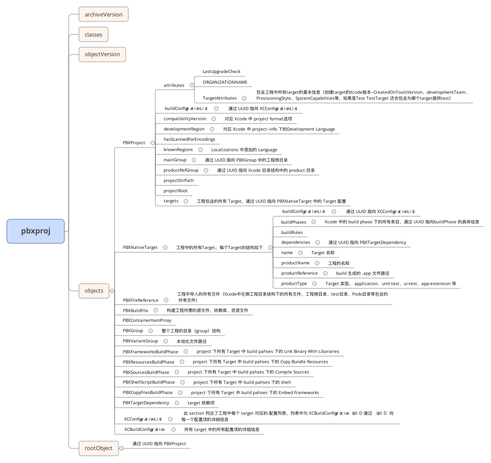

## pbxproj （Project Builder XCode Project）

pbxproj是一种旧风格的plist文件格式，其中包含了几乎所有工程编译所需相关的信息，看起来比较恶心(不知道这个格式为什么一直沿用至今，可能是懒得换吧)，可以通过 Mac 自带工具将 plutil 转为 JSON 或 XML，格式看起来是清爽了，但是pbxproj中的注释就没有了，看起来也不是很方便。在pbxproj中大部分配置都是以 UUID-value 形式呈现的，配置项通过 UUID 引用相互关联，所有 UUID 后都会跟一个注释来表明通过该 UUID 引用的是个什么东西。

### 基本结构

```
// !$*UTF8*$!
{
    archiveVersion = 1;
    classes = {
    };
    objectVersion = 50;
    objects = {
        ....
    };
    rootObject = ...;
}
```

key | valueType | value | comment
--- | -----------| ------| -------
archiveVersion | Number | 1 | 
classes | Dictionary | Empty | 
objectVersion | Number | |  与 Xcode 中选择的 project format 对应，详情见下表
objects | Dictionary |  | objects以 UUID-Value 形式包含了project构建的所有相关信息
rootObject | Reference | object 引用 | object 中 Project object 的 UUID

<br>

compatibilityVersion | objectVersion
---------------------| -------------
Xcode 3.1 | 45
Xcode 3.2 | 46
Xcode 6.3 | 47
Xcode 8.0 | 48
Xcode 9.3 | 50
Xcode 10.0 | 51


在 objects 中，在同一层级下通过 UUID-value 的形式罗列了所有 project 构建相关的信息，不同信息间通过 UID 相互关联，并且以 `/* Begin ..... section */ .... /* End ..... section */`的形式将所有信息分隔成不同的类型，便于查看（一点也不方便，看起来像一坨*一样）


#### PBXFileReference section

该 section 包含所有工程相关的文件引用，包括所有在Xcode左侧我们看到的工程下的文件，如工程主目录，Tests目录，Products目录，Pods目录，Frameworks目录等下的所有文件

```
61A3FDB02282CB2B000AF6BC /* AppDelegate.h */ = {
    isa = PBXFileReference; 
    lastKnownFileType = sourcecode.c.h; 
    path = AppDelegate.h; 
    sourceTree = "<group>"; 
};
```

key | valueType | value | comment
--- | -----------| ------| -------
isa |  | PBXFileReference | 用来表明该object的类型
lastKnownFileType | String? enum? | \<file type\> | 文件类型
path | String | \<file name\> |  文件路径
sourceTree | String | "\<group\>" |

>> 此处的 path 会根据引入文件的方式不同显示不同的值（直接显示文件名称还是显示工程主目录下的相对路径）
>> 例如工程主目录下有一个文件夹其中包含两个文件
>> 1. 直接将文件夹拖入并选择 Create Groups， path 为文件名
>> 2. 直接将文件夹中的两个文件拖入工程，并选择 Create Groups，path 为相对路径


#### PBXGroup section
所有工程中的 fake folder, 因为 Xcode 中添加文件夹一般都是通过 Group 方式导入，实际上都是直接对文件的引用，这里配置了在 Xcode 中我们看到的文件树

```
3F3AE656F07160AA9C7758CD /* Pods */ = {
    isa = PBXGroup;
    children = (
        171CCA00BF79F3D3E96A4364 /* Pods-demoForProj.debug.xcconfig */,
        3EE2ED28267F668CC20441E3 /* Pods-demoForProj.release.xcconfig */,
        0BDE1CB2E2B51EED10B115EB /* Pods-demoForProjTests.debug.xcconfig */,
        412263879C7A4B92041270B6 /* Pods-demoForProjTests.release.xcconfig */,
        523BE2E6534FFC317FBC6869 /* Pods-demoForProjUITests.debug.xcconfig */,
        42B11552779B7FAAEF023FB1 /* Pods-demoForProjUITests.release.xcconfig */,
        BC1C2ED0025945FEAC79287F /* Pods-test.debug.xcconfig */,
        60082A27284E079986A06E7D /* Pods-test.release.xcconfig */,
        1DF280A56937D4D3409A0D69 /* Pods-test1.debug.xcconfig */,
        D1C1B9FCC01A65A69683F320 /* Pods-test1.release.xcconfig */,
    );
    path = Pods;
    sourceTree = "<group>";
};
```

key | valueType | value | comment
--- | -----------| ------| -------
isa | | PBXGroup | 用来表明该object的类型
children | Array | file or group reference | 如果是子"目录"则为对应 PBXGroup 的 UUID，如果是文件则为对应 PBXFileReference 的 UUID
path | String | PBXGroup 所指向的文件夹名称 | Xcode 文件树中为文件夹，且文件夹真实存在，则有此项
name | String | Xcode 中创建的 Group | Xcode 文件树中为文件夹，但文件夹并不真实存在，而是在 Xcode 中创建的 Group
sourceTree | String | "\<group\>" |

#### PBXVariantGroup section

本地化相关的 Group，添加多种语言之后的 storyboard 文件下会包含多个本地化文件

```
6145A4B8227FCEAC00814412 /* Main.storyboard */ = {
    isa = PBXVariantGroup;
    children = (
        6145A4B9227FCEAC00814412 /* Base */,
        6153829322812D6B00BFD2E0 /* zh-Hans */,
    );
    name = Main.storyboard;
    sourceTree = "<group>";
};
```


####  PBXBuildFile section

该 section 包含所有需要编译为二进制文件以及在编译过程中需要 copy 到 app package 中的文件

```
0B78D925F3EEFE0786E3A909 /* libPods-demoForProj.a in Frameworks */ = {
    isa = PBXBuildFile; 
    fileRef = D39532A74655956C2ED072F7 /* libPods-demoForProj.a */; 
};

```

key | valueType | value | comment
--- | -----------| ------| -------
isa |  | PBXFileReference | 用来表明该object的类型
filRef | UUID | file ref UUID | 通过 UUID 引用 PBXFileReference 中对应的 文件


#### PBXProject section

Project object 也就是配置文件顶层的 rootObject 所引用的对象, 代表该工程，解析的时候也应该是从这里开始逐级查找的

```
6145A4A7227FCEAC00814412 /* Project object */ = {
    isa = PBXProject;
    attributes = {
        CLASSPREFIX = Test;
        LastUpgradeCheck = 1010;
        ORGANIZATIONNAME = "Home Credit China";
        TargetAttributes = {
            6145A4AE227FCEAC00814412 = {
                CreatedOnToolsVersion = 10.1;
            };
        };
    };
    buildConfigurationList = 6145A4AA227FCEAC00814412 /* Build configuration list for PBXProject "demoForProj" */;
    compatibilityVersion = "Xcode 9.3";
    developmentRegion = en;
    hasScannedForEncodings = 0;
    knownRegions = (
        en,
        Base,
        "zh-Hans",
    );
    mainGroup = 6145A4A6227FCEAC00814412;
    productRefGroup = 6145A4B0227FCEAC00814412 /* Products */;
    projectDirPath = "";
    projectRoot = "";
    targets = (
        6145A4AE227FCEAC00814412 /* demoForProj */,
    );
};
```

key | valueType | value | comment
--- | -----------| ------| -------
isa | | PBXProject | 用来表明该object的类型
attributes | Dictionary | | 工程基础参数
buildConfigurationList | UUID | |  通过 UUID 引用 XCConfigurationList 中 PBXProject 的配置项
compatibilityVersion | String | | 与 Xcode 中选择的 project format 对应
developmentRegion | String | English | 
hasScannedForEncodings | bit | 0 | 
knownRegions | Array | langues list | project 添加的语言
mainGroup | UUID | | 通过 UUID 引用工程根目录, 也就是xcodeproj所在的目录
productRefGroup | UUID | | 通过 UUID 引用 Products Group，Xcode文件树中的Products目录
projectDirPath | String | |
projectRoot | String | |
targets | Array | | 工程中包含的Target

`attributes` 中配置了工程及Target相关的基础参数，`CLASSPREFIX` 为 Xcode 中配置的 Class Prefix，`ORGANIZATIONNAME` 为 Xcode 中配置的 Organization，`TargetAttributes`中分别设置了各个 target 的基础参数，如：“DevelopmentTeam” 开发组，也就是App Develop Team ID ，“ProvisioningStyle” 签名方式-自动还是手动， “SystemCapabilities” Xcode 中Capabilities-Target需要用到的系统功能 ， “CreatedOnToolsVersion” 创建 Target 的 Xcode 版本。

#### PBXNativeTarget section
section 中罗列了所有 project 中包含的 target 的信息

```
6145A4AE227FCEAC00814412 /* demoForProj */ = {
    isa = PBXNativeTarget;
    buildConfigurationList = 6145A4DB227FCEAD00814412 /* Build configuration list for PBXNativeTarget "demoForProj" */;
    buildPhases = (
        96B6C26FA39BAC67072F7E5C /* [CP] Check Pods Manifest.lock */,
        6145A4AB227FCEAC00814412 /* Sources */,
        6145A4AC227FCEAC00814412 /* Frameworks */,
        6145A4AD227FCEAC00814412 /* Resources */,
        615382922281234600BFD2E0 /* Embed App Extensions */,
    );
    buildRules = (
        615382AD2285174B00BFD2E0 /* PBXBuildRule */,
    );
    dependencies = (
        6153828D2281234600BFD2E0 /* PBXTargetDependency */,
        61A3FD7522812DFB000AF6BC /* PBXTargetDependency */,
    );
    name = demoForProj;
    productName = demoForProj;
    productReference = 6145A4AF227FCEAC00814412 /* demoForProj.app */;
    productType = "com.apple.product-type.application";
};
```

key | valueType | value | comment
--- | -----------| ------| -------
isa | | PBXNativeTarget | 用来表明该object的类型
buildConfigurationList | UUID | | 
buildPhases | Array | buildPases References | 通过 UUID 引用 BuildPhase section 中对应的build Phase，可以在 Xcode 中的 buildPhase 中查看
buildRules | Array| PBXBuildRule References | 通过 UUID 引用 PBXBuildRule section 中的对应项
dependencies| Array | PBXTargetDependency References | 通过 UUID 引用 PBXTargetDependency section 中的对应项，表明该 Target 依赖于哪些 Target
name| String | Target Name |
productName | String | | 创建 target 时设置的 product name
productReference | UUID | | target 编译后生成的在 Productions Group 中的文件引用 
productType | String |  | target 编译后生成的目标文件类型


#### Build Phases Sections

由于在 Target 中 build phases 是一个大类，所以所有 build phases sections 都在此列举，所有相关的 build phase 都可以在 Xcode 中的 Build Phases 中找到

##### PBXSourcesBuildPhase section

Build 时需要编译的源文件

```
6145A4AB227FCEAC00814412 /* Sources */ = {
    isa = PBXSourcesBuildPhase;
    buildActionMask = 2147483647;
    files = (
        6145A4EB227FDC3B00814412 /* TestC.c in Sources */,
        615382A922850AFB00BFD2E0 /* test123.m in Sources */,
        6145A4E8227FDC1B00814412 /* TestCC.cpp in Sources */,
        615382A522850AF100BFD2E0 /* test123.m in Sources */,
        6145A4C2227FCEAD00814412 /* main.m in Sources */,
        6145A4B4227FCEAC00814412 /* AppDelegate.m in Sources */,
        61A3FDA22281757E000AF6BC /* ViewController.m in Sources */,
    );
    runOnlyForDeploymentPostprocessing = 0;
};
```
key | valueType | value | comment
--- | -----------| ------| -------
isa | | PBXSourcesBuildPhase | 用来表明该object的类型
buildActionMask | Number | 2^32-1 |
files | Array | source file reference | 通过 UUID 引用 PBXBuildFile 中的对应项
runOnlyForDeploymentPostprocessing | Number | 0

##### PBXResourcesBuildPhase section

Build 时需要拷贝到 package 中的源文件

```
6145A4AD227FCEAC00814412 /* Resources */ = {
    isa = PBXResourcesBuildPhase;
    buildActionMask = 2147483647;
    files = (
        6145A4BF227FCEAD00814412 /* LaunchScreen.storyboard in Resources */,
        6145A4BC227FCEAD00814412 /* Assets.xcassets in Resources */,
        61628475227FE10A001BA530 /* test.json in Resources */,
        615382A12284287F00BFD2E0 /* test123 in Resources */,
        6145A4E5227FD68400814412 /* TestX.xib in Resources */,
        6145A4BA227FCEAC00814412 /* Main.storyboard in Resources */,
    );
    runOnlyForDeploymentPostprocessing = 0;
};
```

key | valueType | value | comment
--- | -----------| ------| -------
isa | | PBXResourcesBuildPhase | 用来表明该object的类型
buildActionMask | Number | 2^32-1 |
files | Array | source file reference | 通过 UUID 引用 PBXBuildFile 中的对应项
runOnlyForDeploymentPostprocessing | Number | 0

##### PBXShellScriptBuildPhase section

添加到 Build Phase 中的 Run Script，也就是 Build 时执行的 shell 脚本

```
615382C4228522AC00BFD2E0 /* Run Script */ = {
    isa = PBXShellScriptBuildPhase;
    buildActionMask = 2147483647;
    files = (
    );
    inputFileListPaths = (
    );
    inputPaths = (
    );
    name = "Run Script";
    outputFileListPaths = (
    );
    outputPaths = (
    );
    runOnlyForDeploymentPostprocessing = 0;
    shellPath = /bin/sh;
    shellScript = "# Type a script or drag a script file from your workspace to insert its path.\n";
};
```
key | valueType | value | comment
--- | -----------| ------| -------
isa | | PBXShellScriptBuildPhase | 用来表明该object的类型
buildActionMask | Number | 2^32-1 |
files | Array | | 
inputFileListPaths | Array | shell 中用于输入文件列表路径 | 可以在 shell 中直接使用此处列出的文件
inputPaths | Array | shell 中用于输入文件路径 | 可以在 shell 中直接使用此处列出的文件
name | String | Build phase 名称 |
outputFileListPaths | | shell 中用于输出文件列表路径 | 可以在 shell 中直接使用此处列出的文件
outputPaths || shell 中用于输出文件路径 | 可以在 shell 中直接使用此处列出的文件
runOnlyForDeploymentPostprocessing | Number | 0 |
shellPath | String | bin/sh | 用来设置用什么工具来执行脚本
shellScript | String |  | 需要执行的脚本

##### PBXCopyFilesBuildPhase section
单独编译后直接拷贝到 package 中的 Framework，对应 Xcode 中 Build Phases 下的 Embed Frameworks，和General 下的 Embedded Binaries。

```
CB99B6F31F025FE800808EEF /* Embed Frameworks */ = {
    isa = PBXCopyFilesBuildPhase;
    buildActionMask = 2147483647;
    dstPath = "";
    dstSubfolderSpec = 10;
    files = (
        03EAB57221C2025500093E66 /* OCR_New.framework in Embed Frameworks */,
    );
    name = "Embed Frameworks";
    runOnlyForDeploymentPostprocessing = 0;
};
```

##### PBXFrameworksBuildPhase section
Build 时编译到 package 二进制文件中的 Frameworks
```
03B65A5621BF981500D72DBD /* Frameworks */ = {
    isa = PBXFrameworksBuildPhase;
    buildActionMask = 2147483647;
    files = (
        03B65ACD21BF994000D72DBD /* libiconv.tbd in Frameworks */,
        03B65ACC21BF992F00D72DBD /* libz.tbd in Frameworks */,
        03B65AC521BF985200D72DBD /* libIDCardBankCard.a in Frameworks */,
        03B65AAC21BF985200D72DBD /* libSTLivenessDetector.a in Frameworks */,
    );
    runOnlyForDeploymentPostprocessing = 0;
};
```

##### PBXHeadersBuildPhase section
PBXCopyFilesBuildPhase 中需单独编译的 Framework 下中供外部调用的头文件
```
03B65A5721BF981500D72DBD /* Headers */ = {
    isa = PBXHeadersBuildPhase;
    buildActionMask = 2147483647;
    files = (
        03B65ABE21BF985200D72DBD /* STVideoCaptureManger.h in Headers */,
    );
    runOnlyForDeploymentPostprocessing = 0;
};
```

#### PBXBuildRule section

对应Xcode 下的 Build Rules，没用过，不知道具体作用，欢迎了解的同学补充
```
615382AD2285174B00BFD2E0 /* PBXBuildRule */ = {
    isa = PBXBuildRule;
    compilerSpec = com.apple.compilers.proxy.script;
    fileType = sourcecode.metal;
    isEditable = 1;
    outputFiles = (
    );
    script = "# metal\n";
};
```

#### PBXTargetDependency section
PBXNativeTarget -> dependencies，用来为 Target 提供引用，其中配置了 PBXNativeTarget UUID 以及 PBXContainerItemProxy UUID，用来表明该项所代表的 Target

```
6145A4C9227FCEAD00814412 /* PBXTargetDependency */ = {
    isa = PBXTargetDependency;
    target = 6145A4AE227FCEAC00814412 /* demoForProj */;
    targetProxy = 6145A4C8227FCEAD00814412 /* PBXContainerItemProxy */;
};
```
key | valueType | value | comment
--- | -----------| ------| -------
isa | | PBXTargetDependency | 用来表明该object的类型
target | UUID | | 该项所指向的 Target
targetProxy | UUID | 通过 UUID 引用 PBXContainerItemProxy 中的对应项

#### XCConfigurationList section 

PBXNativeTarget -> buildConfigurationList，某一 Target 下的所有配置项

```
6145A4AA227FCEAC00814412 /* Build configuration list for PBXProject "demoForProj" */ = {
    isa = XCConfigurationList;
    buildConfigurations = (
        6145A4D9227FCEAD00814412 /* Debug */,
        6145A4DA227FCEAD00814412 /* Release */,
    );
    defaultConfigurationIsVisible = 0;
    defaultConfigurationName = Release;
};
```
key | valueType | value | comment
--- | -----------| ------| -------
isa | | XCConfigurationList | 用来表明该object的类型
buildConfigurations | Array | | 通过 UUID 引用 XCBuildConfiguration 中的对应项
defaultConfigurationIsVisible | Number | | 
defaultConfigurationName | String | |


#### XCBuildConfiguration section
build 的详细配置信息

```
6145A4D9227FCEAD00814412 /* Debug */ = {
    isa = XCBuildConfiguration;
    buildSettings = {
        ALWAYS_SEARCH_USER_PATHS = NO;
        CLANG_ANALYZER_LOCALIZABILITY_NONLOCALIZED = YES;
        CLANG_ANALYZER_NONNULL = YES;
        ......
        SDKROOT = iphoneos;
    };
    name = Debug;
};
```
key | valueType | value | comment
--- | -----------| ------| -------
isa | | XCBuildConfiguration | 用来表明该object的类型
buildSettings | Dictionary | | Xcode 中的 Build Settings
name | String | | 配置项的名称

#### PBXContainerItemProxy section

看起来是对于Target的包装，根据ContainerItemProxy 以及 remoteGlobalIDString 不知道是不是各Target 及 App Extension 间调用时查找使用，瞎猜的，不知道，请大神们指正

```
6145A4C8227FCEAD00814412 /* PBXContainerItemProxy */ = {
    isa = PBXContainerItemProxy;
    containerPortal = 6145A4A7227FCEAC00814412 /* Project object */;
    proxyType = 1;
    remoteGlobalIDString = 6145A4AE227FCEAC00814412;
    remoteInfo = demoForProj;
};
```

key | valueType | value | comment
--- | -----------| ------| -------
isa | | PBXContainerItemProxy | 用来表明该object的类型
containerPortal | UUID | | 包含对应 target 的 project
proxyType | Number | 1 | 
remoteGlobalIDString | UUID | | 对应的 Target 的 UUID
remoteInfo | String | | Tareget name


<br>
<br>

最后放个图，许多描述不专业，希望各路大神指正

